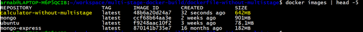
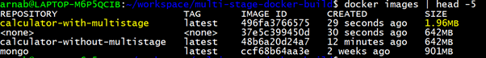

# Multi-Stage Docker Builds — Go Calculator Example

This project demonstrates how to use **multi-stage Docker builds** to create lightweight and secure container images. We'll compare a basic Dockerfile against an optimized multi-stage version using a **distroless image**.

---

## Project Structure

```bash
multi-stage-docker-builds/
├── dockerfile-without-multistage/
│   ├── Dockerfile
│   └── calculator.go
├── dockerfile-with-multistage/
│   ├── Dockerfile
│   └── calculator.go
```

---

## The Go Application

We’re using a simple Go-based calculator app (`calculator.go`) as our example. It performs basic arithmetic operations and can be compiled into a standalone binary.

---

## Approach 1: Dockerfile WITHOUT Multi-Stage

Folder: `dockerfile-without-multistage`

### Dockerfile:

```Dockerfile
FROM ubuntu AS build

RUN apt-get update && apt-get install -y golang-go

ENV GO111MODULE=off

COPY . .

RUN CGO_ENABLED=0 go build -o /app .

ENTRYPOINT ["/app"]
```

### What this does:

- Uses a full **Ubuntu base image**
- Installs **Go toolchain**
- Copies source code and builds the app
- The final image contains:
  - Go compiler
  - Ubuntu OS
  - Source code
  - Compiled binary

### Build & Check Image Size

```bash
cd dockerfile-without-multistage
docker build -t calculator-without-multistage .
docker images
```

### Image Size: **642 MB**

**Problem:** Even though we only want to run the binary, the image contains unnecessary stuff: OS, compilers, tools, and source code — making it bulky.


---

## Approach 2: Multi-Stage Dockerfile + Distroless Image

Folder: `dockerfile-with-multistage`

### Dockerfile:

```Dockerfile
# -----------------------------
#  Stage 1 — Build
# -----------------------------
FROM ubuntu AS build

RUN apt-get update && apt-get install -y golang-go

ENV GO111MODULE=off

COPY . .

RUN CGO_ENABLED=0 go build -o /app .

# -----------------------------
# Stage 2 — Final Clean Image
# -----------------------------
FROM scratch

COPY --from=build /app /app

ENTRYPOINT ["/app"]
```

### What this does:

- **Stage 1 (Build):**
  - Uses Ubuntu just to compile the Go app
  - Installs Go, copies source code, builds a binary

- **Stage 2 (Final):**
  - Uses `scratch` — a **distroless, empty image**
  - Copies only the compiled binary (`/app`)
  - No OS, no Go tools, no shell — just the binary

### Note:
- This works because **Go produces statically linked binaries** (it doesn't need a runtime).
- If you were using **Python**, this approach would fail unless you include the Python runtime manually.
- You can explore other distroless images (e.g., `python`, `nodejs`) from [Google’s official repo](https://github.com/GoogleContainerTools/distroless).

### Build & Check Image Size

```bash
cd dockerfile-with-multistage
docker build -t calculator-with-multistage .
docker images
```

### Image Size: **1.96 MB**

 **Result:** We have managed to reduce our image size by over **640 MB** using best practices.
 

---

## Why Multi-Stage Builds + Distroless?

- **Cleaner Images:** Only what you need is included — no clutter
- **Smaller Size:** Faster builds, less bandwidth
- **More Secure:** No shell, no package manager, no extra tools — means **fewer attack surfaces**
- **Production-Ready:** You’re shipping only the final binary — nothing more

---

## How to Run the Image

```bash
docker run --rm calculator-with-multistage
```

(Or use `calculator-without-multistage` to compare.)

---

## References

- [Multi-Stage Builds – Official Docker Docs](https://docs.docker.com/build/building/multi-stage/)
- [Distroless Images by Google](https://github.com/GoogleContainerTools/distroless)

---

## Conclusion

Using **multi-stage builds** and **distroless base images** not only reduces your Docker image size from **642 MB ➜ 1.96 MB**, but also increases security and performance — making it ideal for production-grade containers.
